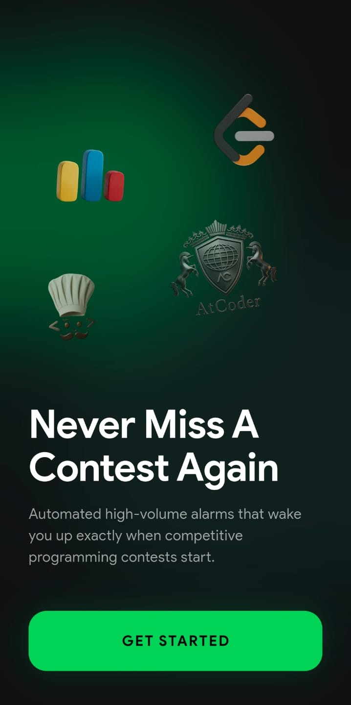
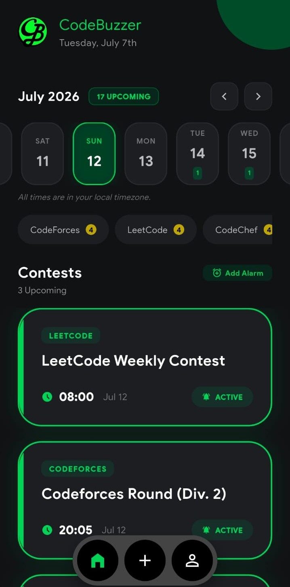
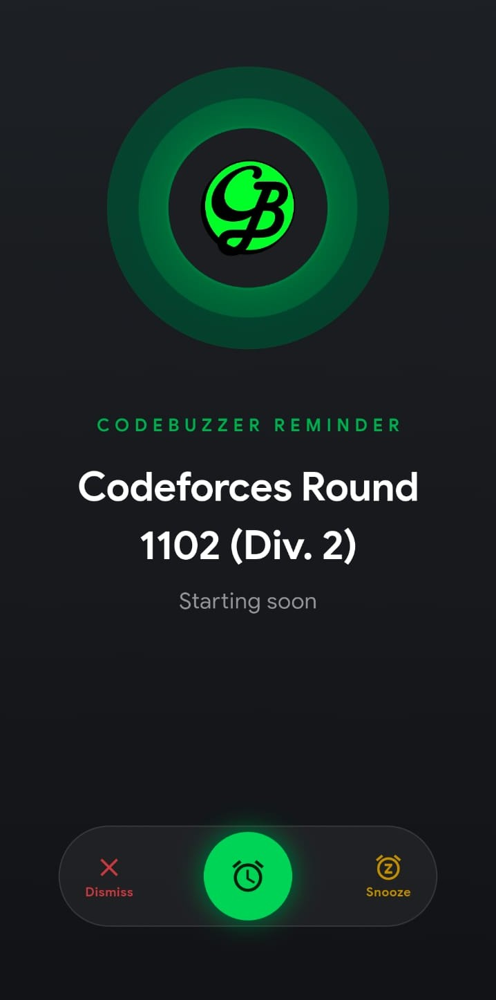
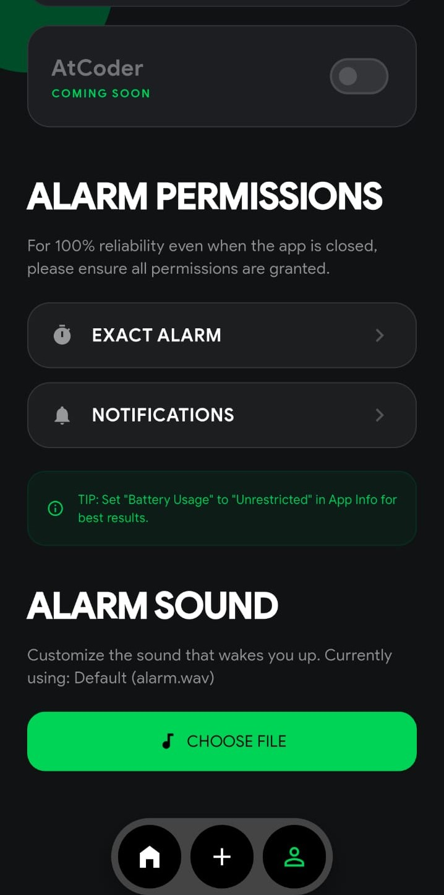

<!-- <p align="center">
  
</p>

<h1 align="center">CodeBuzzer</h1>
 -->


<p align="center">
  <strong>Never miss a competitive programming contest again.</strong><br/>
  <em>A beautiful, fully-automated alarm app that wakes you up before every contest — even if you forget.</em>
</p>

<p align="center">
  <a href="#features"></a>
  <a href="#tech-stack"></a>
  <a href="https://github.com/sambhandavale/CodeBuzzer/blob/main/LICENSE"></a>
</p>

<p align="center">
  <a href="https://github.com/sambhandavale/CodeBuzzer/releases/latest/download/cb_v1.0.0.apk">
    
  </a>
</p>

<br/>

<p align="center">
  
</p>

## 📸 Screenshots

<table>
  <tr>
    <td align="center"><br/><b>Onboarding</b></td>
    <td align="center"><br/><b>Contest Calendar</b></td>
  </tr>
  <tr>
    <td align="center"><br/><b>Full-Screen Alarm</b></td>
    <td align="center"><br/><b>Settings</b></td>
  </tr>
</table>

---

## 💡 The Problem

You're a competitive programmer. You know that feeling:

> _"Wait, there was a Codeforces round today?!"_

You set calendar reminders. You forget to check them. You rely on willpower. You oversleep. You miss Div. 2 rounds, weekly LeetCode contests, and CodeChef starters — **over and over again.**

**CodeBuzzer exists to make that impossible.**

---

## 🚀 Features

### 🔔 Aggressive, Multi-Stage Alarm System

Not just one gentle notification. CodeBuzzer hits you with a **cascade of escalating reminders**:

| Time Before Contest | Alert Type                                           |
| ------------------- | ---------------------------------------------------- |
| ⏳ 30 minutes       | Push notification                                    |
| ⏳ 10 minutes       | Push notification                                    |
| 🔊 5 minutes        | **Full-screen ringing alarm** (loud, with vibration) |
| 🟢 Contest start    | Push notification                                    |

The full-screen alarm rings **even when your phone is locked or the app is closed.** It's like a phone call you can't ignore.

### 📅 Smart Contest Calendar

- Horizontal scrollable calendar with contest indicators on each day
- Smart date-snapping — auto-jumps to the next contest day on launch
- Filter by platform to see only contests you care about
- Platform-specific timeline mode for focused browsing

### 🌐 Multi-Platform Support

| Platform       | Source                                 | Status              |
| -------------- | -------------------------------------- | ------------------- |
| **Codeforces** | Live API (`codeforces.com/api`)        | ✅ Real-time        |
| **LeetCode**   | Hardcoded schedule (Weekly + Biweekly) | ✅ Always available |
| **CodeChef**   | Hardcoded schedule (Weekly)            | ✅ Always available |
| **AtCoder**    | —                                      | 🔜 Coming soon      |

> LeetCode and CodeChef contests follow fixed schedules, so they're generated locally — **no API dependency, no failures, works offline.**

### 🔄 Background Sync (48h Auto-Refresh)

CodeBuzzer uses Android's **WorkManager** to silently sync contests every 48 hours in the background. Even if you don't open the app for a month, your alarms will keep updating themselves.

### 📱 Swipe-to-Action Alarm Screen

When the alarm rings, you get a beautiful full-screen experience:

- **Swipe left** → Dismiss
- **Swipe right** → Snooze (5 min)
- Or just **tap** the labels directly

No accidental dismissals. Inspired by the phone call UX.

### ⏰ Custom Manual Reminders

Have a mock contest? A study session? An interview?

- Tap **"Add Alarm"** on any date to create your own custom reminder
- Set a title, description, and exact time
- Full alarm support — just like contest reminders

### 🎨 Premium Dark UI

- Glassmorphism design with frosted blur effects
- Animated nebula landing screen with dancing platform logos
- Smooth micro-animations and transitions
- Green accent color palette (`#1CD065`)
- Google Sans typography throughout

### ⚙️ Full Customization

- **Toggle platforms** on/off independently
- **Custom alarm sounds** — pick any audio file from your phone
- **Permission manager** — one-tap setup for exact alarms, notifications & overlays
- Battery optimization tips built-in

---

## 🛠️ Tech Stack

| Layer            | Technology                                                                            |
| ---------------- | ------------------------------------------------------------------------------------- |
| Framework        | Flutter (Dart)                                                                        |
| State Management | Provider                                                                              |
| Alarms           | [`alarm`](https://pub.dev/packages/alarm) package                                     |
| Notifications    | [`flutter_local_notifications`](https://pub.dev/packages/flutter_local_notifications) |
| Background Sync  | [`workmanager`](https://pub.dev/packages/workmanager)                                 |
| HTTP             | [`http`](https://pub.dev/packages/http)                                               |
| Storage          | [`shared_preferences`](https://pub.dev/packages/shared_preferences)                   |
| Permissions      | [`permission_handler`](https://pub.dev/packages/permission_handler)                   |

---

## 📦 Project Structure

```
lib/
├── main.dart                      # App entry + WorkManager setup
├── models/
│   └── contest.dart               # Contest data model
├── providers/
│   └── contest_provider.dart      # State management & alarm scheduling
├── services/
│   ├── alarm_service.dart         # Alarm & notification scheduling
│   └── api_service.dart           # API calls + hardcoded contest generation
└── ui/
    ├── screens/
    │   ├── alarm_ring_screen.dart  # Full-screen alarm with swipe actions
    │   ├── home_screen.dart        # Calendar + contest list
    │   ├── landing_screen.dart     # Animated onboarding
    │   ├── main_screen.dart        # Bottom nav shell
    │   └── settings_screen.dart    # Platform toggles, sounds, permissions
    └── widgets/
        ├── add_alarm_popup.dart    # Manual alarm creation sheet
        └── mesh_background.dart    # Decorative background widget
```

---

## 🏁 Getting Started

### Prerequisites

- Flutter SDK `>=3.10.4`
- Android Studio / VS Code
- An Android device or emulator (API 21+)

### Installation

```bash
# Clone the repo
git clone https://github.com/sambhandavale/CodeBuzzer.git
cd CodeBuzzer

# Install dependencies
flutter pub get

# Run on your device
flutter run

# Build release APK
flutter build apk
```

The release APK will be at `build/app/outputs/flutter-apk/app-release.apk`.

---

## 🔐 Permissions

CodeBuzzer requests the following permissions for reliable alarm delivery:

| Permission                             | Why                                   |
| -------------------------------------- | ------------------------------------- |
| `INTERNET`                             | Fetch Codeforces contests from API    |
| `SCHEDULE_EXACT_ALARM`                 | Precise alarm scheduling              |
| `POST_NOTIFICATIONS`                   | Push notification reminders           |
| `SYSTEM_ALERT_WINDOW`                  | Full-screen alarm overlay             |
| `RECEIVE_BOOT_COMPLETED`               | Restore alarms after phone restart    |
| `WAKE_LOCK`                            | Keep alarm ringing when screen is off |
| `FOREGROUND_SERVICE`                   | Background alarm service              |
| `REQUEST_IGNORE_BATTERY_OPTIMIZATIONS` | Prevent OS from killing the app       |

> **Tip:** For the most reliable experience, go to **App Info → Battery → Unrestricted**.

---

## 🤝 Contributing

Contributions are welcome! Here are some ways you can help:

- 🐛 **Report bugs** — Open an issue
- 💡 **Suggest features** — Start a discussion
- 🔧 **Submit PRs** — Fork, branch, code, and open a pull request
- ⭐ **Star the repo** — It helps more than you think!

---

## 📋 Roadmap

- [x] Codeforces real-time API integration
- [x] LeetCode hardcoded weekly + biweekly contests
- [x] CodeChef hardcoded weekly contests
- [x] Multi-stage alarm cascade (30m, 10m, 5m, start)
- [x] Background sync with WorkManager
- [x] Custom alarm sounds
- [x] Swipe-to-dismiss alarm screen
- [x] Manual alarm creation
- [ ] AtCoder support
- [ ] Contest rating predictions
- [ ] Contest problem difficulty analysis
- [ ] iOS support
- [ ] Widgets for home screen

---

## 📄 License

This project is licensed under the MIT License — see the [LICENSE](LICENSE) file for details.

---

<p align="center">
  <strong>Built with 💚 for competitive programmers who oversleep.</strong>
</p>

<p align="center">
  <a href="https://github.com/sambhandavale/CodeBuzzer/stargazers">
    
  </a>
</p>
